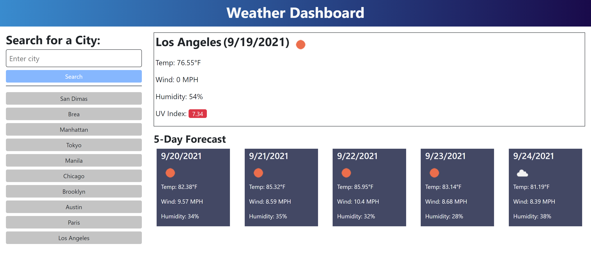

# Weather Dashboard
An application that displays the weather outlook for multiple cities.

https://kg-phantom.github.io/weather-dashboard/

## City Search
The user can search the name of a city and be presented with the current and future weather conditions for that city including:
- The date
- An icon representation of weather conditions
- Temperature
- Humidity
- Wind speed
- UV index

## Future Forecast
When a city is searched, the future 5-day forecast is displayed, including all of the above information.

## Search History
Each city search is saved to the search history for easy access.

The previous 10 searches are displayed as buttons.

When a city in the search history is clicked, the current and future conditions for that city are presented.